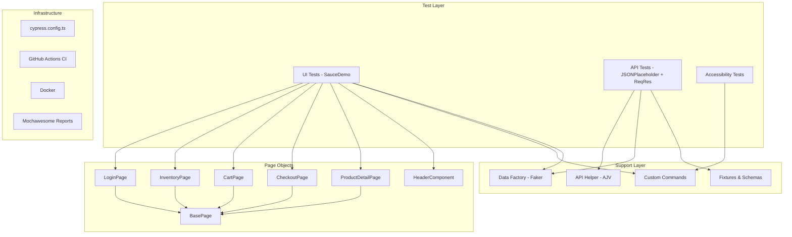

# 🧪 QA Automation Framework — Cypress

[](https://github.com/lucianomartinsjr/qa-automation-framework-cypress/actions)
[](https://www.cypress.io/)
[](https://www.typescriptlang.org/)
[](https://opensource.org/licenses/MIT)

> Professional end-to-end testing framework demonstrating **UI testing**, **API testing**, **Page Object Model architecture**, **schema validation**, **accessibility audits**, and **CI/CD pipeline** — all with real, working websites.

---

## 📋 Table of Contents

- [Tech Stack](#-tech-stack)
- [Architecture](#-architecture)
- [Features](#-features)
- [Project Structure](#-project-structure)
- [Getting Started](#-getting-started)
- [Running Tests](#-running-tests)
- [Test Suites](#-test-suites)
- [CI/CD Pipeline](#-cicd-pipeline)
- [Docker](#-docker)
- [Reports](#-reports)

---

## 🛠 Tech Stack

| Technology | Purpose |
|---|---|
| [Cypress 15](https://www.cypress.io/) | E2E Testing Framework |
| [TypeScript](https://www.typescriptlang.org/) | Type-safe test development |
| [Faker.js](https://fakerjs.dev/) | Dynamic test data generation |
| [AJV](https://ajv.js.org/) | JSON Schema validation |
| [cypress-axe](https://github.com/component-driven/cypress-axe) | Accessibility testing |
| [cypress-grep](https://github.com/cypress-io/cypress/tree/develop/npm/grep) | Tag-based test filtering |
| [Mochawesome](https://github.com/adamgruber/mochawesome) | HTML test reports |
| [ESLint + Prettier](https://eslint.org/) | Code quality & formatting |
| [GitHub Actions](https://github.com/features/actions) | CI/CD pipeline |
| [Docker](https://www.docker.com/) | Containerized execution |

---

## 🏗 Architecture



---

## ✨ Features

| Category | Feature | Status |
|---|---|:---:|
| **UI Testing** | Login (9 scenarios) | ✅ |
| | Inventory (sorting, add to cart) | ✅ |
| | Cart (add/remove, checkout) | ✅ |
| | Checkout (E2E purchase flow) | ✅ |
| | Navigation (menu, logout, reset) | ✅ |
| **API Testing** | Full CRUD (GET, POST, PUT, PATCH, DELETE) | ✅ |
| | JSON Schema Validation (AJV) | ✅ |
| | Authentication (register/login) | ✅ |
| | Pagination & Query Parameters | ✅ |
| | Response Time Assertions | ✅ |
| **Quality** | Accessibility Audit (cypress-axe) | ✅ |
| | Tag-based Filtering (@smoke, @regression) | ✅ |
| | Dynamic Data (Faker.js) | ✅ |
| | Auto-retry on Failure | ✅ |
| **DevOps** | Multi-browser CI (Chrome, Firefox, Edge) | ✅ |
| | Parallel API + UI Pipelines | ✅ |
| | Docker Support | ✅ |
| | HTML Reports with Screenshots | ✅ |

---

## 📁 Project Structure

```
qa-automation-framework-cypress/
├── cypress/
│   ├── e2e/
│   │   ├── api/
│   │   │   ├── posts.cy.ts          # CRUD + schema validation
│   │   │   ├── users-api.cy.ts       # ReqRes users CRUD + pagination
│   │   │   └── auth-api.cy.ts        # Register & login flows
│   │   └── ui/
│   │       ├── login.cy.ts           # 9 login scenarios
│   │       ├── inventory.cy.ts       # Sorting, products, cart
│   │       ├── cart.cy.ts            # Cart management
│   │       ├── checkout.cy.ts        # E2E purchase flow
│   │       ├── navigation.cy.ts      # Menu, logout, reset
│   │       └── accessibility.cy.ts   # a11y audits
│   ├── fixtures/
│   │   ├── schemas/                  # JSON Schemas for AJV
│   │   │   ├── post-schema.json
│   │   │   ├── user-schema.json
│   │   │   └── auth-schema.json
│   │   ├── users.json                # All 6 SauceDemo users
│   │   ├── checkout-data.json        # Checkout form scenarios
│   │   └── api-payloads.json         # API request payloads
│   ├── pages/
│   │   ├── components/
│   │   │   └── HeaderComponent.ts    # Sidebar, cart badge
│   │   ├── BasePage.ts              # Base class (POM)
│   │   ├── LoginPage.ts
│   │   ├── InventoryPage.ts
│   │   ├── CartPage.ts
│   │   ├── CheckoutPage.ts
│   │   └── ProductDetailPage.ts
│   └── support/
│       ├── api-helper.ts             # Typed API wrapper + AJV
│       ├── commands.ts               # Custom Cypress commands
│       ├── data-factory.ts           # Faker-based data factory
│       └── e2e.ts                    # Global setup
├── .github/workflows/ci.yml          # Multi-browser CI pipeline
├── cypress.config.ts
├── docker-compose.yml
├── Dockerfile
├── package.json
└── tsconfig.json
```

---

## 🚀 Getting Started

### Prerequisites

- **Node.js** 18+ (recommended: 20 LTS)
- **npm** 9+

### Installation

```bash
git clone https://github.com/lucianomartinsjr/qa-automation-framework-cypress.git
cd qa-automation-framework-cypress
npm install
```

---

## 🧪 Running Tests

| Command | Description |
|---|---|
| `npm run cy:open` | Open Cypress interactive runner |
| `npm test` | Run all tests headless |
| `npm run test:ui` | Run UI tests only |
| `npm run test:api` | Run API tests only |
| `npm run test:smoke` | Run @smoke tagged tests |
| `npm run test:regression` | Run @regression tagged tests |
| `npm run test:a11y` | Run accessibility tests |
| `npm run test:ci` | Run all tests in Chrome (CI) |
| `npm run test:ci:firefox` | Run all tests in Firefox |
| `npm run lint` | Check code quality |
| `npm run format` | Format code with Prettier |
| `npm run report:open` | Generate HTML report |

---

## 📊 Test Suites

### 🖥️ UI Tests — [SauceDemo](https://www.saucedemo.com)

Real e-commerce application covering the complete user journey:

- **Login** — Valid/invalid credentials, locked users, empty field validation
- **Inventory** — Product listing, all 4 sort options, add/remove from cart
- **Cart** — Item management, continue shopping, proceed to checkout
- **Checkout** — Full purchase E2E, form validation, order confirmation
- **Navigation** — Sidebar menu, logout, cart badge updates, app reset
- **Accessibility** — WCAG compliance audit with axe-core

### 🔌 API Tests — [JSONPlaceholder](https://jsonplaceholder.typicode.com) + [ReqRes.in](https://reqres.in)

Real hosted APIs for comprehensive API validation:

- **Posts CRUD** — GET, POST, PUT, PATCH, DELETE with schema validation
- **Users** — List, create, update, delete with pagination
- **Authentication** — Register/login success and error scenarios
- **Contract Testing** — JSON Schema validation with AJV
- **Performance** — Response time threshold assertions

---

## 🔄 CI/CD Pipeline

The GitHub Actions workflow runs on every push/PR to `main`:

```
Lint → API Tests (parallel) → Report
     → UI Tests (Chrome)    →
     → UI Tests (Firefox)   →
     → UI Tests (Edge)      →
```

- ✅ ESLint check before tests
- ✅ Parallel API + UI execution
- ✅ Multi-browser matrix (Chrome, Firefox, Edge)
- ✅ Artifact upload (screenshots, videos, reports)
- ✅ Mochawesome HTML report generation

---

## 🐳 Docker

```bash
# Build and run all tests
docker compose up --build

# Run only UI tests
docker compose up cypress-ui --build

# Run only API tests
docker compose up cypress-api --build
```

---

## 📈 Reports

Tests generate **Mochawesome HTML reports** with embedded screenshots:

```bash
# After running tests
npm run report:open
```

Reports are saved to `cypress/reports/html/`.

---

## 📄 License

This project is licensed under the MIT License.

---

<p align="center">
  <b>Built with ❤️ for quality.</b>
</p>
